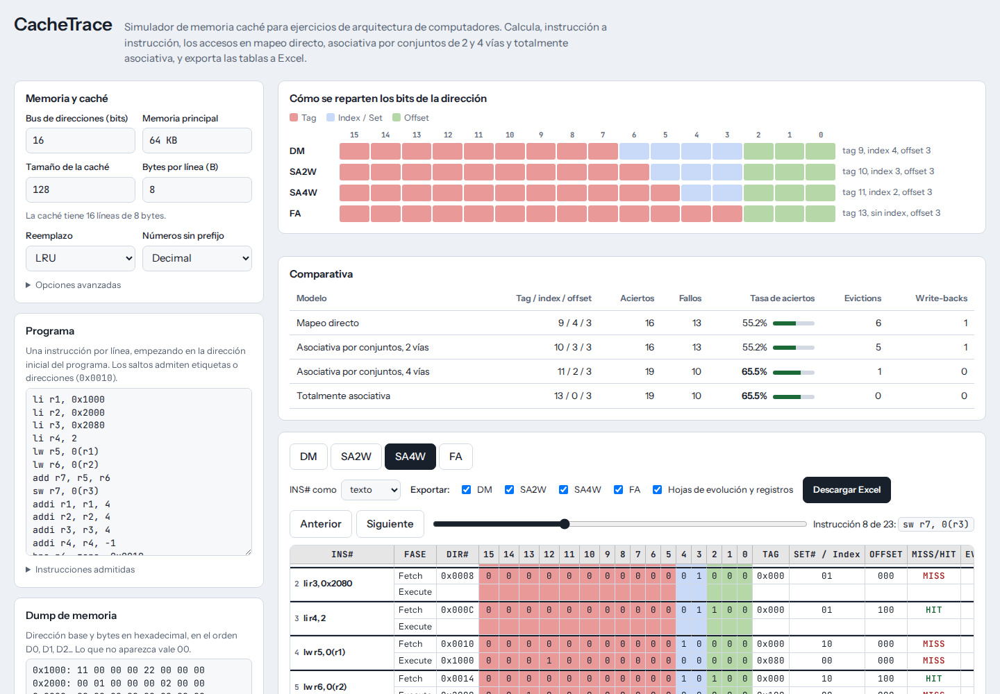

# CacheTrace

**Cache memory simulator for computer architecture exercises: trace every access in direct-mapped, 2-way, 4-way and fully associative caches, and export the tables to Excel.**

**Simulador de memoria caché para ejercicios de arquitectura de computadores: traza cada acceso en mapeo directo, asociativa de 2 y 4 vías y totalmente asociativa, y exporta las tablas a Excel.**

[](https://github.com/FACIIAN/cachetrace/actions/workflows/pages.yml) [](LICENSE)

[Website](https://faciian.github.io/cachetrace/) · [Open the app](https://faciian.github.io/cachetrace/app/) · [English guide](docs/guide.en.md) · [Guía en español](docs/guide.es.md)

English | [Español](#español)



## English

CacheTrace takes the data of a cache exercise (address bus, cache size, bytes per line, a small program and a memory dump) and replays it, instruction by instruction, on four cache organizations at once. For every Fetch and Execute it shows the address split into tag, index and offset, whether it is a hit or a miss, which line is evicted, whether a write-back happens, and the state of the cache and the registers afterwards.

Everything runs in your browser. There is no server, no account, and nothing you enter leaves your computer.

### Highlights

- Direct-mapped, 2-way (SA2W), 4-way (SA4W) and fully associative (FA) caches for the same program.
- Bit split derived from the address bus, the cache size and the bytes per line, with fixed colours: tag, index and offset.
- Fetch and Execute per instruction (`lw` and `sw` add their data access), with step-by-step navigation.
- RISC-style programs with loops: `li`, `lw`, `lb`, `sb`, `addi`, `bne`… byte, half-word and word accesses; labels or addresses as jump targets; `zero` register.
- Memory dump byte by byte in hexadecimal; 32-bit words in little-endian.
- Write-back with write-allocate; LRU or FIFO replacement; invalid lines are filled in order.
- Excel export with one sheet per cache, bit formulas, final state, registers, and optional evolution sheets.
- Bilingual website (Spanish and English). The application interface is currently in Spanish.

### Use

Open the [app](https://faciian.github.io/cachetrace/app/) and fill in the exercise. Nothing needs to be installed. To run it from source, see [Development](#development).

### Example

The input below (16-bit bus, 128 B cache, 8 B lines) is included in [`examples/`](examples), together with its solved workbook.

```
li r1, 0x1000
li r2, 0x2000
li r3, 0x2080
li r4, 2
lw r5, 0(r1)
lw r6, 0(r2)
add r7, r5, r6
sw r7, 0(r3)
addi r1, r1, 4
addi r2, r2, 4
addi r3, r3, 4
addi r4, r4, -1
bne r4, zero, 0x0010
nop
```

```
0x1000: 11 00 00 00 22 00 00 00
0x2000: 00 01 00 00 00 02 00 00
0x2080: 00 00 00 00 00 00 00 00
```

Result over 29 accesses:

| Cache | Hits | Misses | Evictions | Write-backs |
| --- | ---: | ---: | ---: | ---: |
| Direct-mapped | 16 | 13 | 6 | 1 |
| SA2W | 16 | 13 | 5 | 1 |
| SA4W | 19 | 10 | 1 | 0 |
| FA | 19 | 10 | 0 | 0 |

### Conventions and limitations

CacheTrace always applies the same rules: unified cache, initially empty; write-back with write-allocate; LRU (or FIFO), taking invalid lines first in ascending order; 32-bit words in little-endian; execution ends at `nop`. It models a fixed write policy, and it is a study tool: check the results against your own problem statement. See the [technical guide](docs/guide.en.md) for the details.

### Development

Requires Node.js 20 or later.

```bash
npm ci          # install development dependencies
npm test        # tests, including a cross-check against an independent reference model
npm run build   # generate ./dist (website + app)
npm start       # serve ./dist at http://localhost:8080
```

The engine (`src/engine.js`) has no DOM code, so it can be tested from Node. Every change to the cache behaviour should come with a test.

- [Changelog](CHANGELOG.md)
- [License](LICENSE) · [Third-party notices](THIRD_PARTY_NOTICES.md)

---

[English](#english) | Español

## Español

CacheTrace toma los datos de un ejercicio de caché (bus de direcciones, tamaño de la caché, bytes por línea, un programa pequeño y un dump de memoria) y lo reproduce, instrucción a instrucción, en cuatro organizaciones de caché a la vez. Para cada Fetch y Execute muestra la dirección dividida en tag, index y offset, si es hit o miss, qué línea se desaloja, si hay write-back y el estado posterior de la caché y de los registros.

Todo se ejecuta en tu navegador. No hay servidor ni cuentas, y nada de lo que introduces sale de tu ordenador.

### Funciones principales

- Mapeo directo, asociativa de 2 vías (SA2W), de 4 vías (SA4W) y totalmente asociativa (FA) para el mismo programa.
- Reparto de bits calculado a partir del bus, el tamaño de la caché y los bytes por línea, con colores fijos: tag, index y offset.
- Fetch y Execute por instrucción (`lw` y `sw` añaden su acceso a datos), con navegación paso a paso.
- Programas tipo RISC con bucles: `li`, `lw`, `lb`, `sb`, `addi`, `bne`… accesos de byte, media palabra y palabra; etiquetas o direcciones como destino de salto; registro `zero`.
- Dump de memoria byte a byte en hexadecimal; palabras de 32 bits en little-endian.
- Write-back con write-allocate; reemplazo LRU o FIFO; las líneas inválidas se ocupan por orden.
- Exportación a Excel con una hoja por caché, fórmulas para los bits, estado final, registros y hojas de evolución opcionales.
- La web es bilingüe (español e inglés); la interfaz de la aplicación está por ahora en español.

### Uso

Abre la [aplicación](https://faciian.github.io/cachetrace/app/) y rellena el ejercicio. No hay que instalar nada. Para ejecutarla desde el código, consulta [Desarrollo](#desarrollo).

### Ejemplo

La entrada de arriba (bus de 16 bits, caché de 128 B, líneas de 8 B) está en [`examples/`](examples), junto con su libro de Excel resuelto. Resultado sobre 29 accesos: DM 16 aciertos y 13 fallos; SA2W 16 y 13; SA4W 19 y 10; FA 19 y 10.

### Convenciones y limitaciones

CacheTrace aplica siempre las mismas reglas: caché unificada, inicialmente vacía; write-back con write-allocate; LRU (o FIFO), tomando primero las líneas inválidas en orden ascendente; palabras de 32 bits en little-endian; la ejecución termina en `nop`. Modela una política de escritura fija, y es una herramienta de estudio: contrasta los resultados con tu enunciado. Los detalles están en la [guía técnica](docs/guide.es.md).

### Desarrollo

Requiere Node.js 20 o superior.

```bash
npm ci          # instala las dependencias de desarrollo
npm test        # tests, con comparación contra un modelo de referencia independiente
npm run build   # genera ./dist (web + aplicación)
npm start       # sirve ./dist en http://localhost:8080
```

El motor (`src/engine.js`) no usa el DOM, así que se puede probar desde Node. Todo cambio en el comportamiento de la caché debería ir acompañado de un test.

- [Historial de cambios](CHANGELOG.md)
- [Licencia](LICENSE) · [Avisos de terceros](THIRD_PARTY_NOTICES.md)

## License / Licencia

CacheTrace is distributed under the MIT license. Copyright (c) 2026 FACIIAN. See [LICENSE](LICENSE).

CacheTrace se distribuye bajo la licencia MIT. Copyright (c) 2026 FACIIAN. Consulta [LICENSE](LICENSE).
